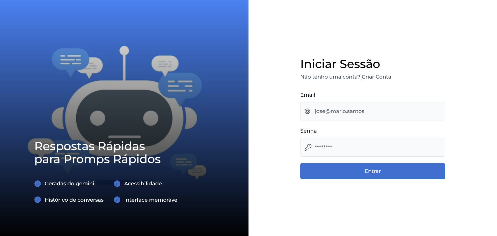
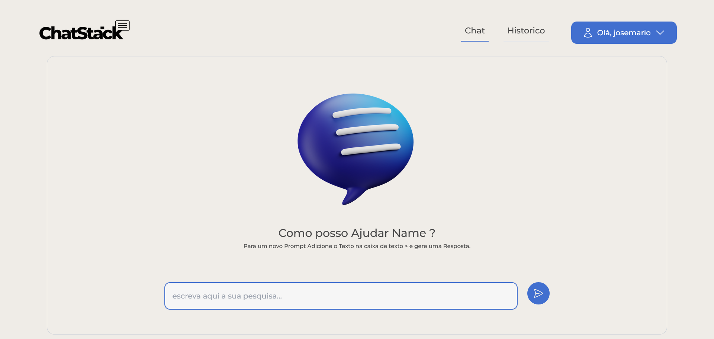

# ChatStack Bot

ChatStack Bot é um chatbot avançado que integra a API Gemini IA e utiliza os serviços do Firebase para autenticação e banco de dados. Este projeto foi criado para fornecer uma interface de conversação inteligente, segura e escalável.

## Funcionalidades

- **Integração com Gemini IA**: Utiliza a API Gemini IA para processar e gerar respostas inteligentes.
- **Autenticação Firebase**: Implementa autenticação de usuários com o Firebase Authentication.
- **Banco de Dados Firebase**: Armazena e gerencia dados de usuários e conversas utilizando o Firebase Realtime Database.

## Tecnologias Utilizadas

- **Gemini IA API**: Para processamento de linguagem natural e geração de respostas.
- **Firebase Authentication**: Para autenticação de usuários.
- **Firebase Realtime Database**: Para armazenamento e gerenciamento de dados.
- **React.js**: Biblioteca JavaScript para construção da interface de usuário.

Area de Login
- 

Area de Chat
- 

